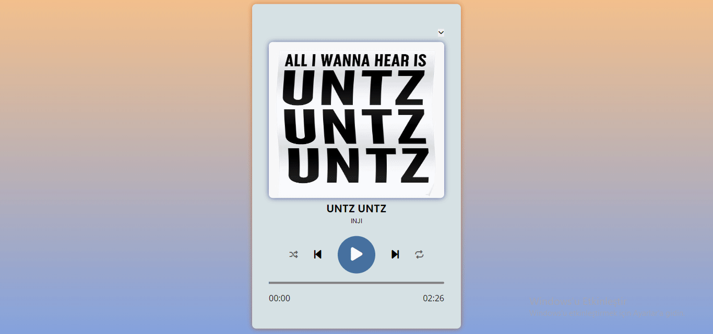

# Music Player Project

This is a simple web-based music player project created using HTML, CSS, and JavaScript. The project provides a user-friendly interface for playing, pausing, and navigating through a playlist of songs.

## Table of Contents

- [Features](#features)
- [Getting Started](#getting-started)
- [Usage](#usage)
- [File Structure](#file-structure)
- [Dependencies](#dependencies)
- [Contributing](#contributing)
- [License](#license)

## Features

- Play, pause, and navigation controls for the music player.
- Responsive design for various screen sizes.
- Playlist functionality with shuffle and repeat options.
- Visual progress bar to track the current playback position.

## Getting Started

To get started with the project, follow these steps:

1. Clone the repository to your local machine:

   ```bash
   git clone https://github.com/your-username/music-player.git
2. Open the project folder in your preferred code editor.

3. Launch the index.html file in a web browser.


## Usage
* Press the play button to start playback.
* Use the pause button to pause the current song.
* Navigate to the next or previous track using the corresponding buttons.
* Enable shuffle for a random playback order.
* Repeat the current track with the repeat button.

## File Structure
The project structure is as follows:

* index.html: HTML file defining the structure of the web page.
* style.css: CSS file containing the styling for the music player.
* main.js: JavaScript file with the logic for controlling the music player.
* assets/: Directory containing images and audio files used in the project.

# GIF


## Dependencies
* Font Awesome: Used for icons.
* Google Fonts: Used for Open Sans and Poppins fonts.

## Contributing
* Contributions are welcome! If you find any issues or have suggestions for improvements, feel free to open an issue or submit a pull request.

## License
* This project is licensed under the MIT License.
